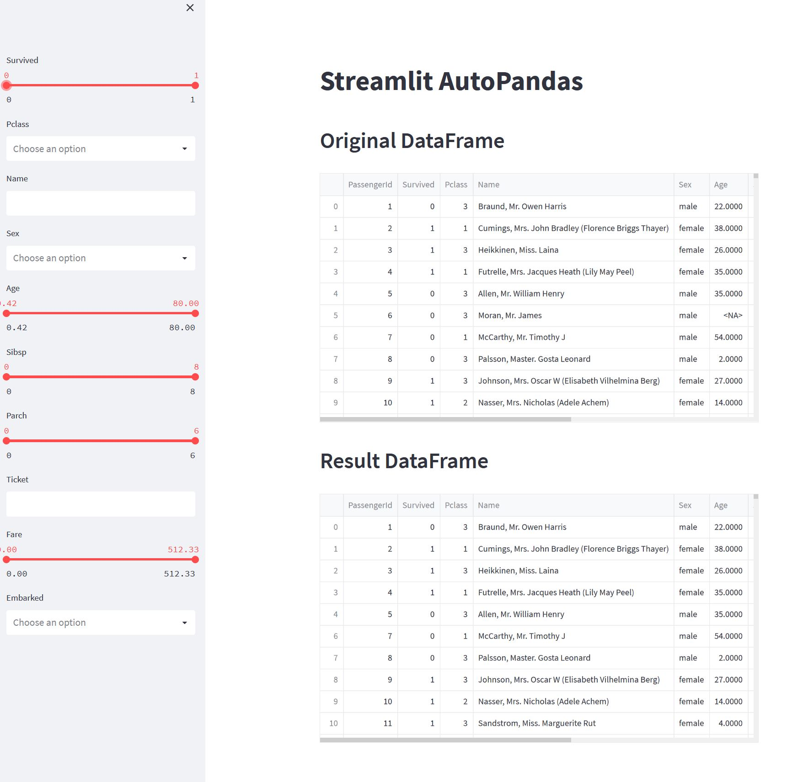

# Streamlit Pandas
Streamlit Pandas is a component for the [Streamlit](https://streamlit.io/) library. It allows users to load a Pandas DataFrame and automatically generate Streamlit widgets in the sidebar. These widgets trigger filtering events within the Pandas DataFrame

# Installation
1. First, install Streamlit
```python
pip install streamlit
```
2. Next, install Pandas
```python
pip install pandas
```
3. Install Streamlit Pandas
```python
pip install streamlit-pandas
```

# Usage
```python
import streamlit as st
import pandas as pd
import streamlit_pandas as sp

@st.cache(allow_output_mutation=True)
def load_data():
    df = pd.read_csv(file)
    return df

file = "../data/titanic.csv"
df = load_data()
create_data = {"Name": "text",
                "Sex": "multiselect",
                "Embarked": "multiselect",
                "Ticket": "text",
                "Pclass": "multiselect"}

all_widgets = sp.create_widgets(df, create_data, ignore_columns=["PassengerId"])
res = sp.filter_df(df, all_widgets)
st.title("Streamlit AutoPandas")
st.header("Original DataFrame")
st.write(df)

st.header("Result DataFrame")
st.write(res)
```
This will generate the following application:


